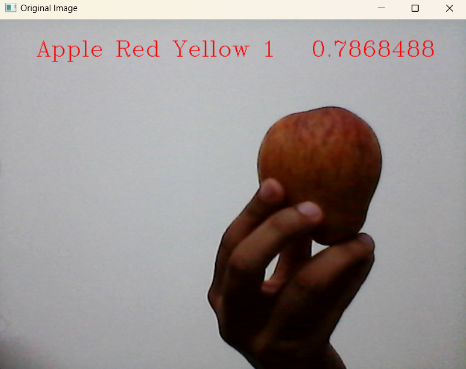

# Fruit Classification using Tensorflow and CNN

This project is a real-time fruit classification system that uses a Convolutional Neural Network (CNN) to classify images of fruits. The TensorFlow and OpenCV approach for fruit classification combines deep learning and image processing techniques to solve complex visual recognition tasks. OpenCV is utilized for image handling, including reading, resizing, and pre-processing, which prepares the data for feeding into a neural network. Pre-processing steps typically involve resizing images for uniformity, converting them to grayscale or normalizing pixel values to enhance learning efficiency. TensorFlow, a popular deep learning framework, is employed to build and train a Convolutional Neural Network (CNN), a type of neural network that excels in recognizing spatial hierarchies in images. CNNs are designed to automatically and adaptively learn the features of input images through convolutional filters and pooling operations, reducing the dimensionality while preserving important features. The model architecture typically includes layers like convolutional, max pooling, dropout, and dense layers, each playing a vital role in extracting features, preventing overfitting, and making predictions. 

### Fruits recognized by the model:

## Dataset : 
The dataset consists of 8007 training images, 3360 test images and 2002 validation images categorized into different folders for fruits.
https://drive.google.com/drive/folders/1dlzrm4-Iip7fNKwI8GVcJNPqhUK8l4ey?usp=drive_link

## Dependencies : 
Ensure you have the required libraries installed - tensorflow, opencv-python, numpy, pandas, matplotlib, scikit-learn.

## Usage:
Training: Run model_train.py to train the model. The model is saved in JSON format (model-bw.json) along with its weights (model-bw.weights.h5).
Inference: Run inference.py to classify fruits in real-time using your webcam.

The project is divided into two major components:

### model_train.ipynb :
1. Purpose: Trains a Convolutional Neural Network (CNN) model for fruit classification using the Fruits dataset.
2. Process: Loads the dataset, preprocesses the images (resizing, grayscale conversion, histogram equalization, and normalization), defines and compiles a CNN model with multiple convolutional, pooling, and dense layers, and further trains the model using data augmentation techniques (rotation, zoom, shear, etc.) to improve generalization.
3. Evaluation: The model's performance is evaluated using accuracy and loss metrics on the validation set. The final model is tested on the test set to measure its generalization ability.
4. Output: A trained CNN model saved as model-bw.json (architecture) and model-bw.weights.h5 (weights), which can be used for real-time fruit classification.

### inference.py :
1. Purpose: Performs real-time fruit classification using a webcam and the trained CNN model.
2. Process: Captures live video from the webcam, preprocesses each frame and displays the predicted fruit name and confidence score on the video feed in real-time.
3. Output: A live video feed with the recognized fruit class and confidence score overlaid on the screen, allowing users to interact with the system in real-time.

By following the steps in this repository, you can train your own fruit recognition model and deploy it for real-time use, making it a valuable tool for educational, assistive, or research purposes.
